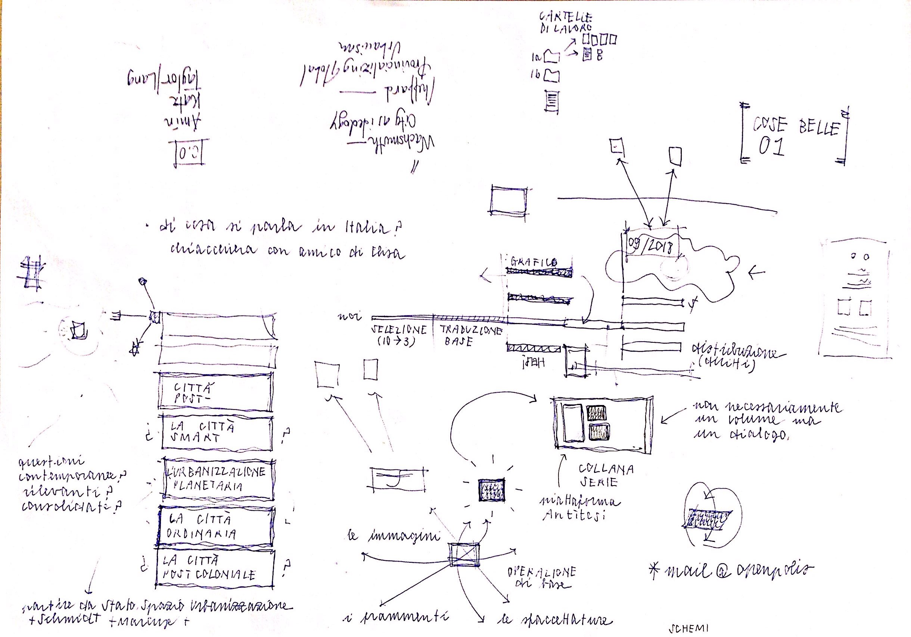

# diario

## 20180515

+ cronoprogramma di massima
+ partenza con due questioni
+ aggiornato todo.txt
+ definizione pagina di presentazione —> *cloud* di supporto
+ possibili volumetti extra (cose molto belle)
+ parlare con grafico  

## 20180522

+ prima scrematura su `planetary urbanization`
    - alcune trad. it. esistenti, apparse su Archivio di Studi Urbani e Regionali (2017) [@brenner:2017] e Rivista Geografica Italiana (2016) [@dibella:2016]
    - numero di citazioni (Scopus) possibile indicatore di rilevanza
